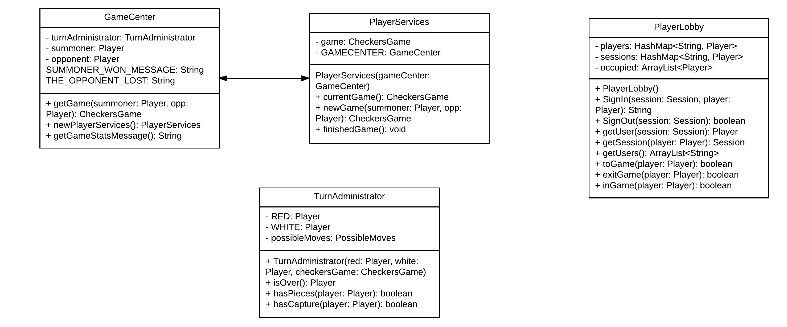
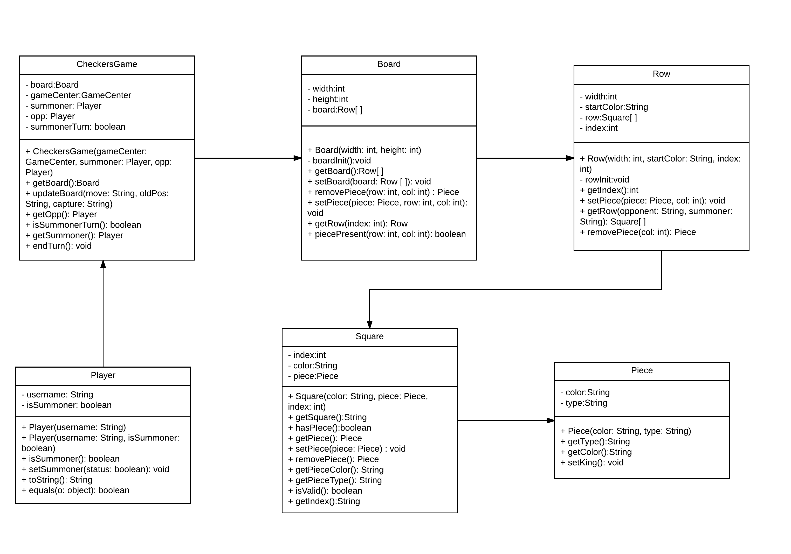
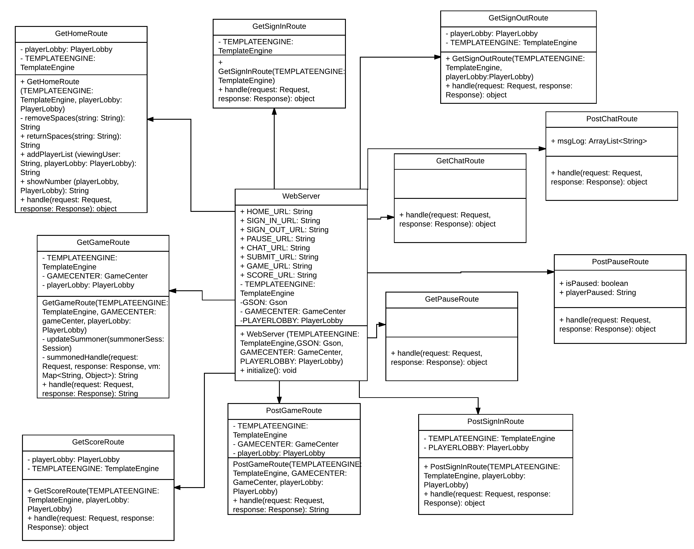
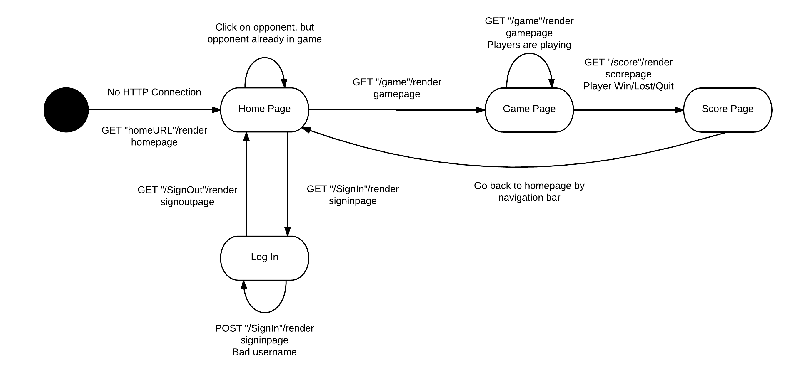
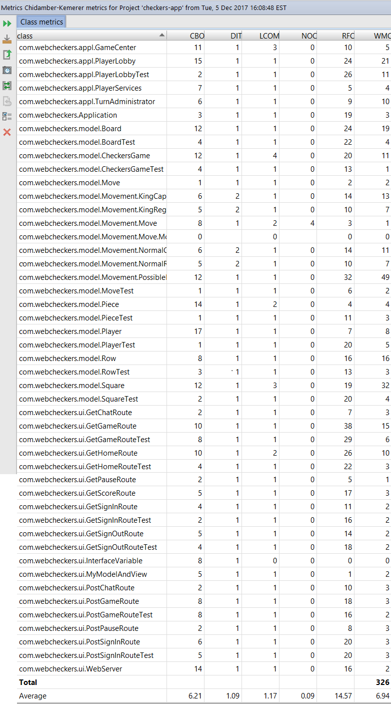
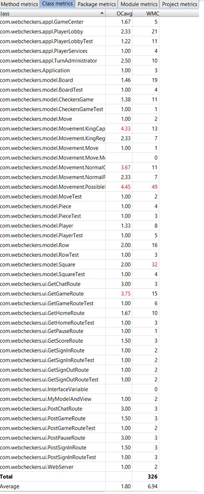
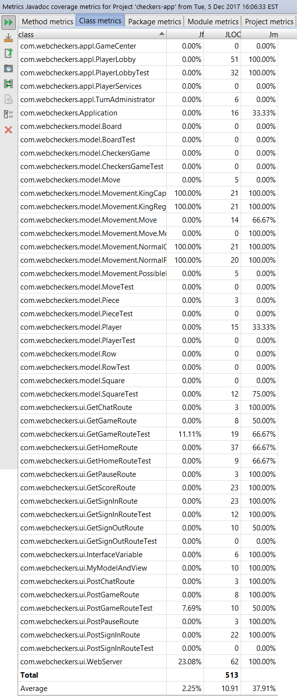
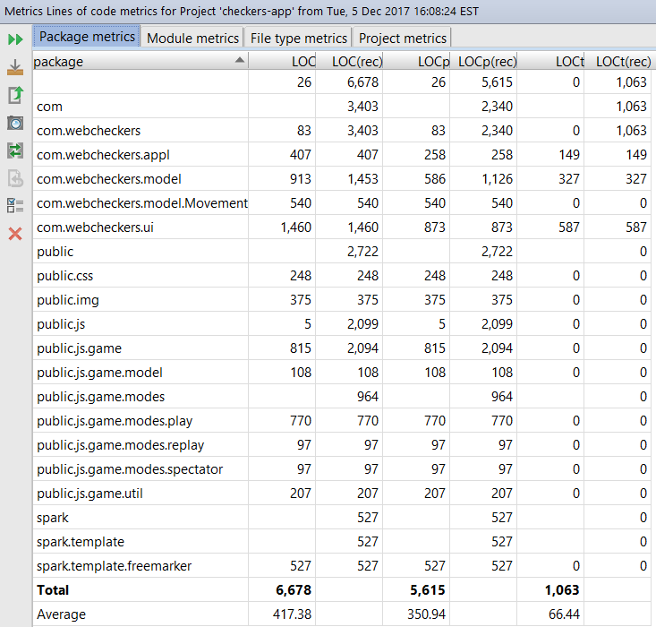
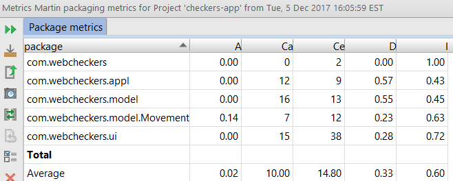

# PROJECT Design Documentation

## Team Information
* Team name: Resistance
* Team members
    * Justin Lam
    * Alan Tan
    * Jesse Chen
    * Elijah Cantella
    * Jay Gogri

## Executive Summary
This is the documentation for our WebCheckers project. This project was made through the use of the Spark framework and FreeMarker template engine.

### Purpose
To allow users to sign in, sign out, and enter a game with another player by clicking on the opponent's name in the home page.

### Requirements

During the first sprint, we were given two main tasks to complete

* Implement a Sign In interface so that users can sign in and sign out
    * Name restrictions
        * No duplicate names
        * No null names such as double quotes (")
    * List out all the users currently online only if the user is sign in
* Implement a Game interface so that users can start a game with each other
    * Utliizing that list a user can click on another player and start a game with him/her
        * If selected player is in a game than, a message should show that a game cannot be started
    * The pieces on the board should be displayed properly, with challenger as red and challenged as white, with respective pieces on the bottom of each user's board
    * Pieces should be draggable and droppable on valid places on the board

During the second sprint, we decided to complete most of the MVP laid out for us.

* Implement the Player Movement
    * Basic movement of one diagonal space
    * Capture movement of two diagonal spaces, and also a necessary opponent piece to capture
    * King movement needs to expand on both of the above
* Implement the Win/Loss scenarios
    * Basically if either player captures all the pieces of the opponent, he/she will win the game.
    * If a player has no more pieces to play with, he/she loses the game.

During the third sprint, the rest of the project had to be completed and bugfree. We decided to complete the MVP and also two Enhancements features.

* Implement the Player Quit, which completes the Win/Loss scenarios.
    * Either one of the players has the option to quit or forfeit the game.
    * This in turn will send both players to the score page with the appropriate message.
* Implement the Enhancements features.
    * Pause and Resume
        * Players can pause the game at any point of the game, and a message will appear noting who paused the game.
        * This makes all the piece not draggable, essentially making the game not playable until a player resumes the game.
    * Game Chat
        * Players can talk to each other while playing the game.

### Definition of MVP
The Minimun Viable Product should be a product that can sign a user in and out (if such user is already signed in), and start a game with properly aligned pieces. With the properly aligned pieces, a player should not be able to move his/her opponent's pieces, and shall only be able to move their own according to a turn based system. The game should work as intended by the American rules.

### MVP Features
* Sign In
    * Player Sign-In
    * Player Sign-Out
* Game Play
    * Player Setup
    * Disc Placement
* Player Turn
    * Player Movement
    * Player Capture
    * Player King
* End Game
    * Player Win
    * Player Lose
    * Player Quit
* Enhancements
    * Pause
    * Resume
    * Game Chat

### Roadmap of Enhancements
* Have fun (:

## Application Domain
This section describes the application domain.

### Overview of Major Domain Areas
The main domain areas are the Player, CheckersGame, Board, Squares, and Pieces. These define the checkers game that two players will play utilizing pieces on a board.

### Details of each Domain Area
* Pieces are utilized to represent either Player on the board, which is either a red or white piece.
* Players play a CheckersGame which is played on a Board represented by Squares.
* Players will take turns to move their own pieces and ultimately win the game.

## Architecture
This section describes the application architecture.

### Summary

The WebCheckers webapp will use a Java-based web server, this is done using the Spark web micro framework and the FreeMarker template engine to handle HTTP requests and generate HTTP responses.

### Overview of User Interface

The application's user interface consists of two parts, the server UI and the Client UI. In the Server UI it is made up of the various routes we implemented so that the Spark framework and the FreeMarker template engine's are able to handle HTTP request and HTTP responses. We also alter and made new ftl files in order to create the Client UI, which is a combinations of HTML and CSS. Together these two parts made up the UI views and UI controllers.

### UI Tier

The user of the application interacts with the UI tier, then the UI tier interacts with the Application and Model tiers. We implemented various routes in order display proper information back to the user.

* GetChatRoute
    * This class allows the two players to talk to each other while playing the game.
* PostChatRoute
    * This class keeps the messages between the players visible and ensures that they don't disappear.
* GetGameRoute
    * This class deals with initializing a game, where a player had clicked on an opponent in the home screen to face against.
        * If the player had clicked on an opponent already in a game then he/she will be sent back to the home page with a error message and may click on another opponent.
        * If it is a valid game, then the player will be the red piece and the opponent will be the white piece with respective pieces on the bottom of whoever's screen.
* PostGameRoute
    * This class deals with the ongoing game that was created in GetGameRoute.
        * Whenever a move is made by the user (either side), this route takes in the information and uses it to update the game itself.
        * The information will be incorporated well into the game but updating the board and views (GetGameRoute).
* GetHomeRoute
    * This is the home screen of the whole application. This is what the player will see as the first thing he/she opens up the web browser.
    * In the navigation bar the player may sign in.
    * Only when he/she is signed may he/she see all the players online and click on someone to face against.
* GetPauseRoute
    * This class allows the game to be paused until later notice (Resume).
* PostPauseRoute
    * Ensures the game is paused indefinitely until later notice (Resume).
* GetScoreRoute
    * This class deals with the end game page.
        * Contains a message regarding the end game state of who won and lost.
* GetSignInRoute
    * When a player decides to sign in, this class allows the player to sign in with a username
* PostSignInRoute
    * When the player enters a username of their choice, this handles if the username is a valid username or not.
    * Returns a error message if the username is taken or if it is a empty username.
* GetSignOutRoute
    * Signs a player out and returns the player to the home page.

### Application Tier
The Application tier holds the logic that controls the flow of the application.

* GameCenter
    * This class initializes a CheckersGame instance.
    * If there is an existing game instance, it will return that instead, so a game wouldn't be lost.
* PlayerLobby
    * Holds all the online players so that they can be displayed in the home page.
* PlayerServices
    * Each player needs to be part of a GameCenter, where they will be part of a CheckersGame
* TurnAdministrator
    * Checks for end game scenarios, such as no remaining moves or no pieces left.

### Model Tier
The Model holds all the of the core domain logic.

* CheckersGame
    * Is part of the GameCenter.
    * Holds a Board.
* Board
    * Initializes the board by passing in white or black tiles to the Row class.
* Row
    * Creates each row on the board using the Square class.
    * Places all the pawn pieces in the rows on the board
* Square
    * Contains information on each individual square on the board.
    * If the square is valid, if it has a Piece.
* Piece
    * Contains information on a singular piece, the color and type.
* Player
    * Contains information on each user of the application as long as they are signed in.
    * Holds his/her username.
* Movement (sub directory)
    * Move
        * An abstract class that defines a move
    * NormalRegularMove
        * Extends the Move class
        * Defines a move that can be made by a pawn moving forward
    * NormalCaptureMove
        * Extends the Move class
        * Defines a capturing move that can be made by a pawn moving forward
    * KingRegularMove
        * Extends the Move class
        * Defines a move that can be made by a king moving forward/backward
    * KingCaptureMove
        * Extends the Move class
        * Defines a capturing move that can be made by a king moving forward/backward
    * PossibleMoves
        * A class that determines the moves that can be made by the player, represented by a list

## Sub-system GameCenter

This section describes the detail design of sub-system GameCenter.

### Purpose of the sub-system

Essentially this the brains of the game part of the application, it is responsible for assigning responsiblities onto other classes. The game hiearachy is basically a GameCenter grabbing a game instance either new or existing (determined in the PlayerServices), then the game has a Board, which has a Row containing Squares with Pieces on it. Then all of these is handled with by the GetGameRoute which displays everything.

## Sub-system TurnAdministrator

This section describes the detail design of sub-system TurnAdministrator.

### Purpose of the sub-system

Essentially this is what determines what an end game is. This basically pulls information off of the PossibleMoves class, which in turn uses information in the other classes in the Movement sub directory. It is responsible for forcing the respective player to make a capture move whenever it is available instead of making a regular forward move. In addition it ends the game whenever it senses that one player has captured all the opposing pieces or no moves can be made.

### Static Models

### Dynamic Models

## Code Metrics

This section will describe the code metric measurements for the following categories.

* Chidamber-Kemerer metrics
* Complexity metrics
* Javadoc coverage metrics
* Lines of code metrics
* Martin package metrics

### Chidamber-Kemerer Metrics

This metric determines coupling between object classes, and lack of cohesion in methods.

We did well in this aspect since, nothing was marked red when calculating this metric.

### Complexity Metrics

This metric is cyclomatic complexity, and is the count of execution paths through a method.

Given this result, we can see that they are a couple of classes that were marked red.

* OCavg (Average Operations Complexity) - amount of some computational resource used by the algorithm, averaged over all possible inputs
    * KingCaptureMove - scored a 4.33
        * Mainly because for a king, it can move backwards and forwards, there are many more types of captures than a regular capture.
        * Decided not to change this class, although it can take up resources.
    * NormalCaptureMove - scored a 3.67
        * Has to cycle through a valid capture move that is made by a pawn, and it is reasonable for it to be taking up resources to do this.
        * Decided not to change this class, although it can take up resources.
    * PossibleMoves - scored a 4.45
        * Needs to determine ALL possible moves that can be made at any given time, it communicates with 4 other classes to accomplish this task and this is justified.
        * Decided not to change this class, although it can take up resources.
    * GetGameRoute - scored a 3.75
        * As the largest route class made, it takes cares of four separate scenarios.
            * Player (summoner) goes into the game
            * Player (opponent) gets dragged into game
            * Player clicks on opponent that is in a game
            * Player forfeits
        * Decided not to change this class, although it can take up resources.
* WMC (Weighted Method Complexity) - sum of complexities of all class methods
    * PossibleMoves
        * As described above, this class should require a lot of resources to accomplish its given task.
        * Decided not to change this class, although it can take up resources.
    * Square
        * This is due to all the switch cases that were implemented.
        * Decided not to change this class, although it can take up resources.

### Javadoc Coverage Metrics

This metric determines the percentage of code coverage we have accomplished

Although nothing is marked in red, one can see that we don't have a good average coverage percentage.

### Lines of Code Metrics

This metric shows the lines of code that was created for this project. This is broken down into categories and per method.

Nothing is marked in red, and the results of this code metric was expected. This project required a lot of lines of code to finish and we think this is a good graphical representation of our project.

### Martin Package Metrics

This metric shows fan-out and fan-in coupling, instability and abstractness.

The results of this metric shows us that we didn't violate the low coupling principle, as both the fan-out and fan-in coupling were low and not marked in red. Since both couplings were low, the instability was also low. 
